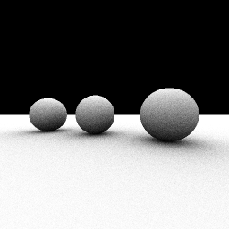

# cl-aobench

[aobench](http://code.google.com/p/aobench/) in CommonLisp




## usage
```
(ql:quickload "aobench")
(aobench:run :file "output.pgm" :n-threads 1)
```

## benchmark results

SBCL ver1.2.1 (x86 Win32) / Core i5 (2Core/4Threads 2.5GHz)

### 1 thread
```
AO SAMPLES: 8
SUBSAMPLING: 2
WIDTH: 256
HEIGHT: 256
THREADS: 1
writing output.pgm
Evaluation took:
  2.973 seconds of real time
  2.979619 seconds of total run time (2.948419 user, 0.031200 system)
  [ Run times consist of 0.094 seconds GC time, and 2.886 seconds non-GC time. ]
  100.24% CPU
  7,409,772,105 processor cycles
  1,114,920,776 bytes consed

done.
```

### 4 threads
```
AO SAMPLES: 8
SUBSAMPLING: 2
WIDTH: 256
HEIGHT: 256
THREADS: 4
writing output.pgm
Evaluation took:
  1.623 seconds of real time
  5.616036 seconds of total run time (5.506836 user, 0.109200 system)
  [ Run times consist of 0.157 seconds GC time, and 5.460 seconds non-GC time. ]
  346.03% CPU
  4,045,283,927 processor cycles
  1,114,829,976 bytes consed

done.
```
